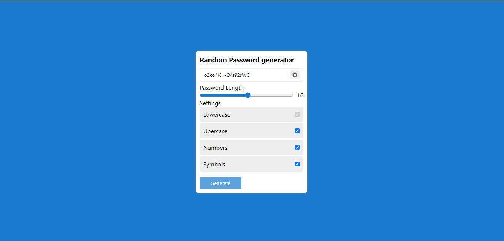

# Password Generator 

this a simple HTML CSS JS password generator with custom settings

## Clone repository 
1- clone or download this repository 
```bash
git clone https://github.com/Ourouimed/Password-Generator.git
```

2- go to your Html file index.html

## Usage
- Generate Random passwords 
- custom settings 
- custom length (from 5 to 35 characters)
- Copy generated password to clipborad
- Your Custom password characters includes :
  - Lowercase (default)
  - Upercase
  - Numbers
# Live Demo 
Try the App from [here](https://ourouimed.github.io/Password-Generator)